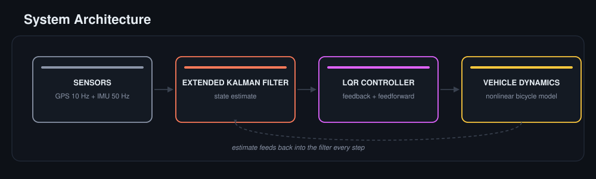
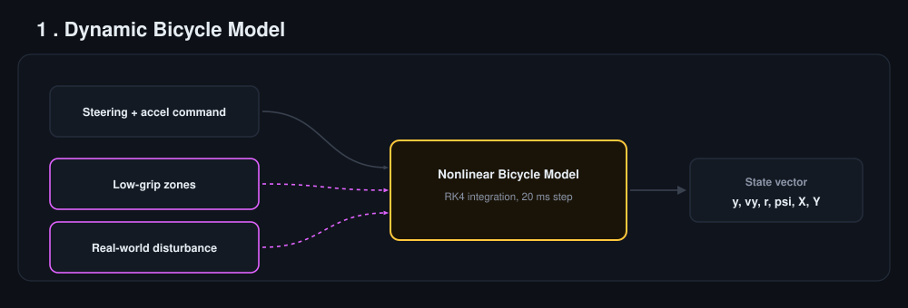
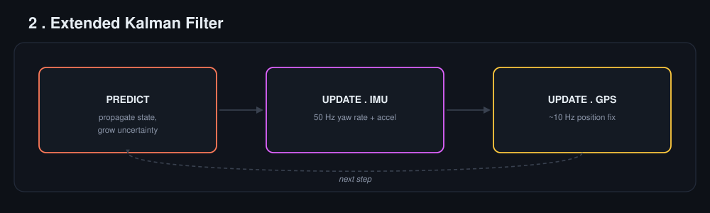
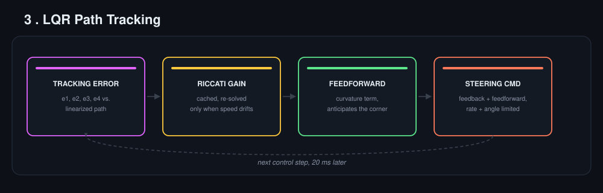
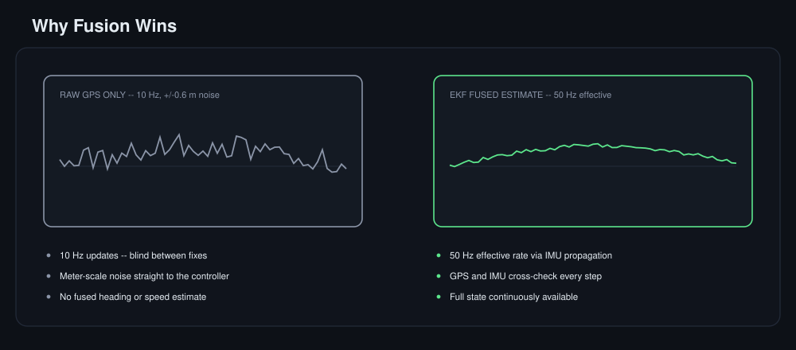
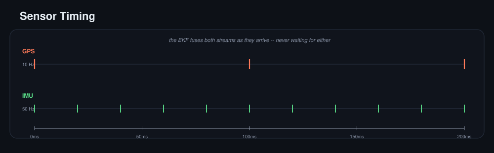
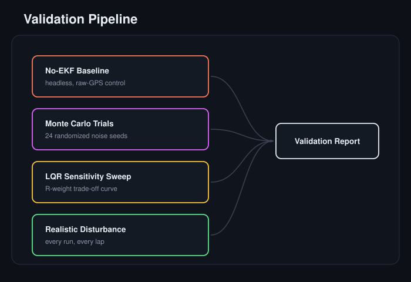
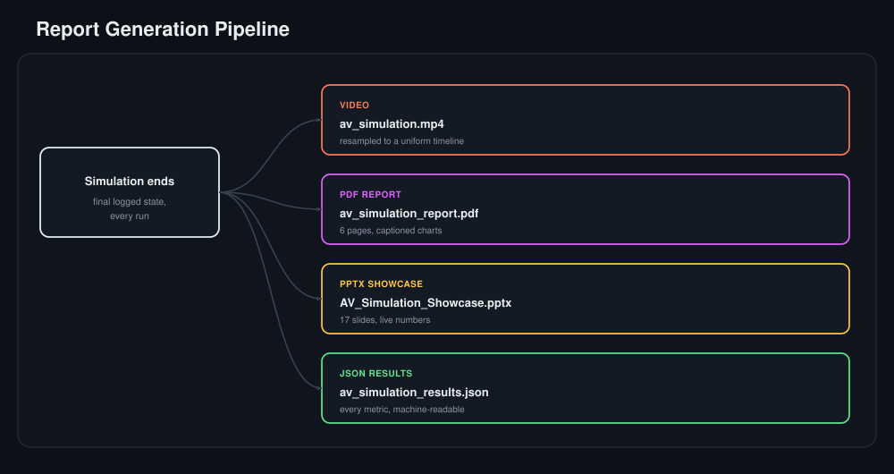

  

<h3 align="center">A from-scratch MATLAB framework for autonomous vehicle state estimation and path tracking</h3>

<i>Nonlinear vehicle dynamics &nbsp;&middot;&nbsp; Extended Kalman Filter sensor fusion &nbsp;&middot;&nbsp; LQR optimal control &nbsp;&middot;&nbsp; built entirely in base MATLAB, no toolboxes</i>

-ff7a59?style=for-the-badge&labelColor=161b22)

---

## Introduction

This project simulates the core pipeline used in real autonomous-driving stacks: a vehicle drives a closed circuit while estimating its own position from noisy, low-rate GPS and higher-rate IMU measurements, then tracks the planned path using an optimal LQR controller. Everything is built from first principles in **base MATLAB** -- no Control System, Optimization, or Robotics toolboxes anywhere in the code. The nonlinear dynamics, the Kalman filter's Jacobians, and the discrete-time LQR solve are all hand-written, and every run automatically produces a matching video, a multi-page PDF report, a PowerPoint showcase, and a machine-readable JSON results file.

The estimate feeds back into the filter every step and the loop runs closed, in real time -- the controller only ever acts on what the EKF currently believes, exactly like a real system would.

## Core Components

Three pieces do all the work, each validated on its own before being wired into the closed loop. The bicycle model supplies the ground-truth physics the other two have to contend with. The Extended Kalman Filter turns noisy, multi-rate sensor readings into one trustworthy state estimate. The LQR controller turns that estimate into a steering command, never touching the ground truth directly. Each gets its own diagram below, in the order data actually flows through them.

## Why Fusion Wins

The two traces below come from the same maneuver, plotted on the same axis. One is what raw GPS reports on its own; the other is what the EKF believes after combining it with the IMU. Same ground truth, two very different pictures of it.

The gap isn't really about sensor quality, it's about update rate. GPS alone only knows where the car was up to 100 ms ago; the EKF fills that gap with IMU propagation in between and corrects it the moment a new fix lands, so the controller is never steering off a stale, blind guess.

## Testing & Verification:
A single good-looking run doesn't prove the estimator actually helps. It could be one lucky draw of sensor noise. Four independent checks close that gap: a raw-GPS baseline to measure what fusion actually buys, many randomized trials to confirm it isn't luck, a sweep across controller tuning, and a disturbance that's never turned off. None of them can fail silently and take the others down with it.

- **No-EKF baseline:** Same controller, re-run headlessly on raw GPS alone, to measure exactly what the filter buys.
- **Monte Carlo trials:** Same comparison across many random noise seeds, so the result is a distribution, not one lucky run.
- **LQR sensitivity sweep:** Steering-effort weight swept across a wide range, tracing the classic accuracy-vs-effort curve.
- **Realistic disturbance:** A physical disturbance on the true vehicle every step, so validation reflects real imperfection.

> Every run's PDF, PPTX, and JSON export these exact numbers computed from *that* run -- they are never a static template. Because sensor noise and the physical disturbance are randomized every run, expect these to vary within a consistent range rather than match exactly.

## Getting Started

No install steps, no dependency list, no toolbox to license -- clone the repository, open av_simulation.m in MATLAB, and press Run. Everything below happens automatically: the live dashboard animates in real time, and once the run ends, the video, PDF report, PPTX showcase, and JSON results all export on their own.

